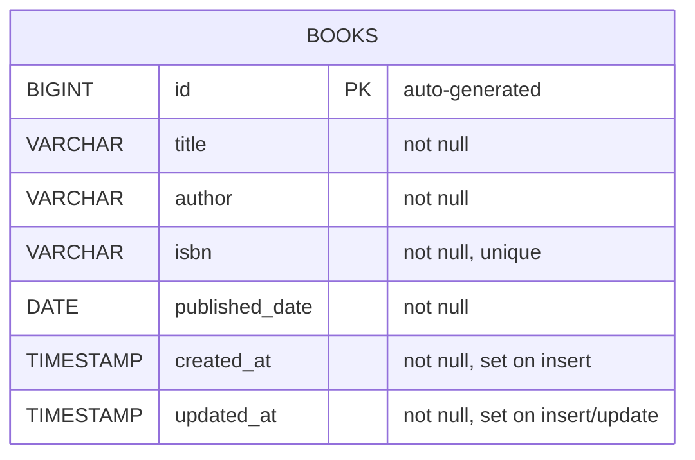

# ER Diagram — Book Management Microservice

## Notes

- `id` is the primary key, generated via `BIGSERIAL` (Postgres identity column).
- `isbn` has a unique constraint (`uq_books_isbn`) so the same book cannot be registered twice.
- `title` has a supporting index (`idx_books_title`) since it's the most likely search/filter field as the service grows.
- `created_at` / `updated_at` are audit columns maintained automatically by JPA lifecycle callbacks (`@PrePersist` / `@PreUpdate`), not set by API consumers.
- Schema is version-controlled via Flyway migration `V1__create_books_table.sql` (`src/main/resources/db/migration`) — this is the source of truth for the schema, not Hibernate auto-DDL.

[`er-diagram.png`](er-diagram.png) for image version.
